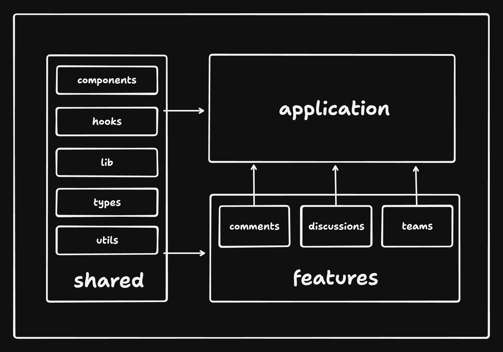

# 🗄️ Project Structure

Most of the code lives in the `src` folder and looks something like this:

```sh
src
|
+-- app               # application layer containing:
|   |                 # this folder might differ based on the meta framework used
|   +-- routes        # application routes / can also be pages
|   +-- app.tsx       # main application component
|   +-- provider.tsx  # application provider that wraps the entire application with different global providers - this might also differ based on meta framework used
|   +-- router.tsx    # application router configuration
+-- assets            # assets folder can contain all the static files such as images, fonts, etc.
|
+-- components        # shared components used across the entire application
|
+-- config            # global configurations, exported env variables etc.
|
+-- features          # feature based modules
|
+-- hooks             # shared hooks used across the entire application
|
+-- lib               # reusable libraries preconfigured for the application
|
+-- stores            # global state stores
|
+-- testing           # test utilities and mocks
|
+-- types             # shared types used across the application
|
+-- utils             # shared utility functions
```

For easy scalability and maintenance, organize most of the code within the features folder. Each feature folder should contain code specific to that feature, keeping things neatly separated. This approach helps prevent mixing feature-related code with shared components, making it simpler to manage and maintain the codebase compared to having many files in a flat folder structure. By adopting this method, you can enhance collaboration, readability, and scalability in the application's architecture.

A feature could have the following structure:

```sh
src/features/awesome-feature
|
+-- api         # exported API request declarations and api hooks related to a specific feature
|
+-- assets      # assets folder can contain all the static files for a specific feature
|
+-- components  # components scoped to a specific feature
|
+-- hooks       # hooks scoped to a specific feature
|
+-- stores      # state stores for a specific feature
|
+-- types       # typescript types used within the feature
|
+-- utils       # utility functions for a specific feature
```

NOTE: You don't need all of these folders for every feature. Only include the ones that are necessary for the feature.

In some cases it might be more practical to keep all API calls outside of the features folders in a dedicated `api` folder where all API calls are defined. This can be useful if you have a lot of shared API calls between features.

In the past, it was recommended to use barrel files to export all the files from a feature. However, it can cause issues for Vite to do tree shaking and can lead to performance issues. Therefore, it is recommended to import the files directly.

It might not be a good idea to import across the features. Instead, compose different features at the application level. This way, you can ensure that each feature is independent which makes the codebase less convoluted.

To forbid cross-feature imports, you can use ESLint:

```js
'import/no-restricted-paths': [
    'error',
    {
        zones: [
            // disables cross-feature imports:
            // eg. src/features/discussions should not import from src/features/comments, etc.
            {
                target: './src/features/auth',
                from: './src/features',
                except: ['./auth'],
            },
            {
                target: './src/features/comments',
                from: './src/features',
                except: ['./comments'],
            },
            {
                target: './src/features/discussions',
                from: './src/features',
                except: ['./discussions'],
            },
            {
                target: './src/features/teams',
                from: './src/features',
                except: ['./teams'],
            },
            {
                target: './src/features/users',
                from: './src/features',
                except: ['./users'],
            },

            // More restrictions...
        ],
    },
],
```

You might also want to enforce unidirectional codebase architecture. This means that the code should flow in one direction, from shared parts of the code to the application (shared -> features -> app). This is a good practice to follow as it makes the codebase more predictable and easier to understand.



As you can see, the shared parts can be used by any part of the codebase, but the features can only import from shared parts and the app can import from features and shared parts.

To enforce this, you can use ESLint:

```js
'import/no-restricted-paths': [
    'error',
    {
    zones: [
        // Previous restrictions...

        // enforce unidirectional codebase:
        // e.g. src/app can import from src/features but not the other way around
        {
            target: './src/features',
            from: './src/app',
        },

        // e.g src/features and src/app can import from these shared modules but not the other way around
        {
            target: [
                './src/components',
                './src/hooks',
                './src/lib',
                './src/types',
                './src/utils',
            ],
            from: ['./src/features', './src/app'],
        },
    ],
    },
],
```

By following these practices, you can ensure that your codebase is well-organized, scalable, and maintainable. This will help you and your team to work more efficiently and effectively on the project.
This approach can also make it easier to apply similar architecture to apps built with Next.js, Remix or React Native.
